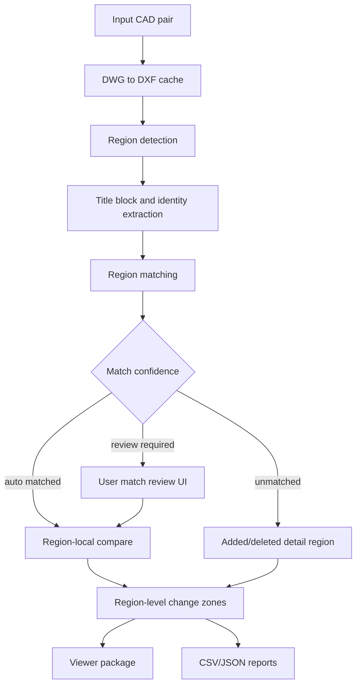

# Multi-Detail Region Compare Agent Plan

**Date**: 2026-05-26
**Status**: Draft implementation plan
**Owner**: Codex / drawing compare agents
**Target area**: CAD DWG/DXF drawings that contain multiple detail drawings in one file

---

## 1. Objective

Build a production workflow that compares multi-detail CAD drawings by detected drawing frames instead of comparing the whole modelspace as one drawing.

The intended workflow is:

1. Detect drawing/detail frames inside each CAD source.
2. Extract title block evidence and drawing identity for each frame.
3. Match before/after frames that represent the same logical detail drawing.
4. Ask the user to review weak or ambiguous matches.
5. Compare only matched frame contents in a local coordinate system.
6. Present results by detail drawing, not only by source file.

This must eliminate the current failure mode where one side is rendered as a small detail region while the other side falls back to the whole modelspace.

---

## 2. Current Evidence

Latest CAD run inspected:

`C:\Users\user\AppData\Local\DrawingCompareWorkbench\runs\compare_20260526_214845`

Observed behavior:

- File-level comparison completed through cached ezdxf fallback.
- Raw changes: `23,502`
- Change zones: `511`
- Region detection output:
  - before: one `cad_spatial_cluster` region
  - after: one `whole_modelspace` fallback region
  - region match: `auto_matched_count=0`
  - warning: `no detail regions reached review threshold`
- Viewer transforms are not comparable:
  - before bbox: small detail area
  - after bbox: full modelspace

Conclusion:

The repository already has diagnostic sidecars for region detection and localized comparison, but the feature is not yet a reliable primary compare path. The next work should promote the sidecar path into a user-reviewed region-local compare workflow.

---

## 3. Product Requirements

### 3.1 In Scope

- CAD inputs: `.dwg`, `.dxf`
- Modelspace drawings containing multiple detail drawings or multiple framed regions
- Paperspace viewport fallback when modelspace frames are not explicit
- Automatic frame detection and confidence scoring
- Before/after region matching
- Manual match review and override
- Region-local comparison after match approval
- Viewer support for region-level compare results
- JSON/CSV artifacts that expose frame detection, matching, and region-local compare results

### 3.2 Out of Scope for MVP

- Guaranteed automatic handling of every customer title block style
- Full OCR pipeline for CAD title blocks
- Full 3D entity support
- Replacing the existing file-level compare path for single-detail drawings
- Automatic localized comparison when region matching is ambiguous

### 3.3 User Workflow

1. User selects before/after CAD files.
2. System scans and detects detail regions.
3. System opens a "Detail Region Matching" review step.
4. User sees:
   - before regions
   - after regions
   - auto matches
   - review-required matches
   - unmatched before/after regions
5. User approves or edits matches.
6. System runs region-local compare for approved matches.
7. Main review table displays one row per region match.
8. Viewer opens before/after crops at equivalent scale and overlays only local changes.

---

## 4. Target Architecture



Existing modules to extend:

- `src/services/comparison/sheet_region_detector.py`
- `src/services/comparison/detail_region_matcher.py`
- `src/services/comparison/localized_compare.py`
- `src/services/comparison/folder_compare_pipeline.py`
- `src/gui/drawing_compare_workbench.py`

New modules expected:

- `src/services/comparison/region_profile.py`
- `src/services/comparison/region_match_overrides.py`
- `src/services/comparison/region_compare_pipeline.py`
- `src/services/comparison/region_viewer_package.py`

---

## 5. Technical Specification

### 5.1 Data Contracts

#### `SheetRegionV2`

Required fields:

```json
{
  "schema_version": 2,
  "region_id": "before-region-001",
  "source_path": "D:/example/before.dwg",
  "source_format": "dwg",
  "side": "before",
  "layout_name": "Model",
  "bbox_world": [0.0, 0.0, 10000.0, 5000.0],
  "rotation_deg": 0.0,
  "scale": 1.0,
  "drawing_number": "SE40-341",
  "title_text": "POT BEARING DETAIL",
  "title_block_bbox": [8000.0, 0.0, 10000.0, 1000.0],
  "entity_count": 1200,
  "layer_histogram": {"0": 100, "FRAME": 4},
  "entity_histogram": {"LINE": 700, "TEXT": 80},
  "detection_method": "cad_line_frame",
  "confidence": 0.92,
  "evidence": ["closed rectangle", "title block text", "frame layer"]
}
```

Compatibility rule:

- Existing `SheetRegion` remains valid.
- V2 fields should be optional at first and written into `metadata` if the current dataclass cannot be changed safely in one step.

#### `RegionMatchV2`

```json
{
  "schema_version": 2,
  "match_id": "pair-a-region-001",
  "before_region_id": "before-region-001",
  "after_region_id": "after-region-004",
  "status": "auto_matched",
  "score": 0.91,
  "component_scores": {
    "drawing_number": 1.0,
    "title_text": 0.84,
    "geometry": 0.73,
    "entity_histogram": 0.79,
    "visual_hash": 0.70
  },
  "reasons": ["drawing number matched", "title tokens similar"],
  "approved_by_user": false,
  "manual_override": false
}
```

#### `LocalizedCompareResultV2`

```json
{
  "schema_version": 2,
  "match_id": "pair-a-region-001",
  "status": "passed",
  "before_region_bbox": [0.0, 0.0, 10000.0, 5000.0],
  "after_region_bbox": [50000.0, 0.0, 60000.0, 5000.0],
  "local_transform": {
    "before_origin": [0.0, 0.0],
    "after_origin": [50000.0, 0.0],
    "rotation_deg": 0.0,
    "scale": 1.0
  },
  "added_count": 0,
  "deleted_count": 0,
  "modified_count": 3,
  "changes": []
}
```

### 5.2 Detection Algorithm

Detection order:

1. Explicit frame entities
   - closed `LWPOLYLINE`
   - rectangular `POLYLINE`
   - four-line rectangle
   - block insert frame expansion
2. Paperspace viewports
3. Title block anchored candidates
4. Large drawing spatial clustering
5. Whole-modelspace fallback

Frame candidate scoring:

| Signal | Weight |
| --- | ---: |
| Closed rectangle or four-line frame | 0.30 |
| On frame/border/title layer | 0.15 |
| Has title block text near lower/right edge | 0.20 |
| Contains mixed CAD entity content | 0.15 |
| Reasonable size and aspect ratio | 0.10 |
| Not a table/BOM/schedule | 0.10 |

Minimum confidence:

- `>= 0.80`: frame
- `0.55 - 0.80`: candidate, review required
- `< 0.55`: reject unless no better fallback exists

Large drawing rule:

- Do not skip clustering only because entity count exceeds `8,000`.
- Replace O(n^2) clustering with grid/R-tree clustering.
- Hard cap output to `max_regions`, but keep diagnostics for dropped candidates.

### 5.3 Identity Extraction

Extract from:

- `TEXT`
- `MTEXT`
- `ATTRIB`
- block attributes
- title block candidate bbox
- layer names and block names as weak evidence

Initial drawing number patterns:

```text
[A-Z]{1,4}[0-9]{1,4}-[0-9]{1,4}
[A-Z]{1,4}[0-9]{1,4}
HD[0-9]{1,3}
SE[0-9]{1,3}-[0-9]{1,4}
S[0-9]{2}-[0-9]{4}
```

Profile extension:

- Add `config/region_profiles/default.yaml`
- Allow customer-specific aliases:
  - frame layers
  - title block layers
  - table/BOM reject keywords
  - drawing number regex
  - title area position

### 5.4 Matching Algorithm

Use one-to-one assignment.

Scoring:

| Component | Weight |
| --- | ---: |
| drawing number exact/normalized match | 0.35 |
| title text token similarity | 0.20 |
| bbox size/aspect similarity | 0.15 |
| layer/entity histogram similarity | 0.20 |
| preview/visual hash similarity | 0.10 |

Thresholds:

- `score >= 0.85` and ambiguity margin `>= 0.12`: auto match
- `0.60 <= score < 0.85`: review required
- `< 0.60`: unmatched

Safety rules:

- If both sides have drawing numbers and they differ, auto match is blocked.
- If a region maps to multiple candidates within ambiguity margin, review is required.
- Manual override always wins and must be written to an artifact.

### 5.5 Region-Local Compare

For each approved match:

1. Clip entities to before/after region bbox.
2. Translate before entities by `-before_bbox.min`.
3. Translate after entities by `-after_bbox.min`.
4. Apply optional rotation/scale normalization.
5. Compare local entities.
6. Translate output bboxes back to after-side or before-side world coordinates.

Output policy:

- Added entities use after-world bbox.
- Deleted entities use before-world bbox.
- Modified entities keep before and after bboxes.
- The viewer should display region-local crop bboxes, not full modelspace.

### 5.6 UI Specification

Add a new review step: "Detail Region Matching".

Screen layout:

- Left list: before regions
- Right list: after regions
- Center table: proposed matches
- Bottom preview: before/after cropped preview
- Actions:
  - approve all high-confidence matches
  - approve selected match
  - rematch selected before/after
  - mark before as deleted detail
  - mark after as added detail
  - rerun region detection with profile

Result table changes:

- One row per `RegionMatch`, not only one row per file pair.
- Columns:
  - drawing number
  - title
  - match status
  - match score
  - added/deleted/modified
  - detection method
  - confidence

### 5.7 Artifacts

Required artifacts:

```text
artifacts/region_detection_v2.json
artifacts/region_match_v2.json
artifacts/manual_region_matches.json
artifacts/localized_compare_results_v2.json
artifacts/localized_change_zones_v2.json
viewer/region_viewer_manifest.json
```

Backward compatibility:

- Continue writing current sidecar files.
- New V2 artifacts must not break current viewer if region mode is off.
- The default output should clearly state whether the primary result is:
  - `file_global`
  - `region_local`
  - `region_review_required`
  - `region_detection_failed`

---

## 6. Feature Flags

Use existing flags first:

- `DRAWING_COMPARE_MULTI_FRAME`
- `DRAWING_COMPARE_AUTO_REGION_COMPARE`

New flags:

```text
DRAWING_COMPARE_REGION_UI=1
DRAWING_COMPARE_REGION_PRIMARY=1
DRAWING_COMPARE_REGION_PROFILE=default
DRAWING_COMPARE_REGION_DEBUG=1
```

Default behavior:

- Keep current global compare as fallback.
- Region matching UI can be enabled before region-local compare becomes default.
- Region-local primary result should remain behind `DRAWING_COMPARE_REGION_PRIMARY=1` until acceptance criteria pass.

---

## 7. Agent Work Plan

Each step below is designed to be executable by one coding agent turn. Agents must keep changes small, run targeted tests, and update this document or `docs/collab/WORKLOG.md` after completing a step.

### Step R0 - Baseline Diagnostics

Goal:

- Capture current failure mode as a regression fixture and diagnostic command.

Files:

- `tests/unit/services/comparison/test_region_aware_compare.py`
- `scripts/diagnose_region_detection.py` (new)
- `docs/collab/WORKLOG.md`

Tasks:

- Add a script that reads a run directory and prints:
  - region counts
  - detection methods
  - match counts
  - whole-modelspace fallback count
  - viewer bbox mismatch ratio
- Add a synthetic regression fixture where one side has multiple frames and the other side currently risks whole-modelspace fallback.

Acceptance:

- `python scripts/diagnose_region_detection.py <run-dir>` reports the current `whole_modelspace` condition.
- Unit test fails on unintended silent whole-modelspace fallback when frame candidates exist.

Validation:

```powershell
python -m pytest tests\unit\services\comparison\test_region_aware_compare.py -q
python scripts\diagnose_region_detection.py "$env:LOCALAPPDATA\DrawingCompareWorkbench\runs\compare_20260526_214845"
```

### Step R1 - Region Profile Configuration

Goal:

- Add configurable frame/title/table detection profiles.

Files:

- `src/services/comparison/region_profile.py` (new)
- `config/region_profiles/default.yaml` (new)
- `src/services/comparison/sheet_region_detector.py`
- `tests/unit/services/comparison/test_region_profile.py` (new)

Tasks:

- Define `RegionProfile`.
- Load default profile without requiring external dependencies beyond stdlib or existing YAML support.
- Add profile fields:
  - frame layer patterns
  - title layer patterns
  - reject keywords
  - drawing number regexes
  - title area policy

Acceptance:

- Detector can run with default profile.
- Tests prove profile patterns affect frame scoring and table rejection.

Validation:

```powershell
python -m pytest tests\unit\services\comparison\test_region_profile.py tests\unit\services\comparison\test_region_aware_compare.py -q
```

### Step R2 - Frame Candidate Engine

Goal:

- Improve explicit frame detection before clustering.

Files:

- `src/services/comparison/sheet_region_detector.py`
- `tests/unit/services/comparison/test_region_aware_compare.py`

Tasks:

- Extract frame candidate scoring into a testable helper.
- Improve closed polyline detection.
- Improve four-line rectangle detection with tolerance.
- Expand block insert frame entities when block contents form a rectangle.
- Reject tables/BOM based on profile and dense text patterns.

Acceptance:

- Synthetic multiple-frame DXF returns more than one `cad_line_frame` or `cad_frame` region.
- Table/BOM rectangle is rejected.
- Detection evidence explains why each region was accepted.

Validation:

```powershell
python -m pytest tests\unit\services\comparison\test_region_aware_compare.py -q
```

### Step R3 - Large Drawing Spatial Clustering

Goal:

- Remove the current entity-count skip for large drawings and replace it with scalable clustering.

Files:

- `src/services/comparison/sheet_region_detector.py`
- `tests/unit/services/comparison/test_region_aware_compare.py`
- `tests/unit/services/comparison/test_spatial_index.py` if shared spatial helpers are touched

Tasks:

- Replace O(n^2) expanded-bbox clustering with grid or R-tree clustering.
- Keep memory and runtime guardrails.
- Emit diagnostics for capped/dropped clusters.
- Avoid using whole-modelspace when candidate clusters are present.

Acceptance:

- A synthetic 15k entity drawing does not skip clustering.
- Runtime stays under an agreed test budget for the synthetic fixture.
- Whole-modelspace fallback is only used when no frame or cluster candidate exists.

Validation:

```powershell
python -m pytest tests\unit\services\comparison\test_region_aware_compare.py -q
python scripts\cad_policy_gate.py
```

### Step R4 - Title Block and Identity Extraction

Goal:

- Improve drawing number and detail title extraction inside each region.

Files:

- `src/services/comparison/sheet_region_detector.py`
- `src/services/comparison/region_profile.py`
- `tests/unit/services/comparison/test_region_aware_compare.py`

Tasks:

- Extract text inside region bbox.
- Prefer title area according to profile.
- Parse `TEXT`, `MTEXT`, `ATTRIB`, and block attributes where available.
- Normalize drawing numbers.
- Store extraction evidence.

Acceptance:

- Regions from synthetic fixtures carry drawing numbers and title text.
- Mismatched drawing numbers block auto match.
- Empty title blocks degrade confidence but do not crash detection.

Validation:

```powershell
python -m pytest tests\unit\services\comparison\test_region_aware_compare.py -q
```

### Step R5 - Region Matching V2

Goal:

- Upgrade matching to one-to-one assignment with ambiguity handling and manual override support.

Files:

- `src/services/comparison/detail_region_matcher.py`
- `src/services/comparison/region_match_overrides.py` (new)
- `tests/unit/services/comparison/test_region_aware_compare.py`
- `tests/unit/services/comparison/test_region_match_overrides.py` (new)

Tasks:

- Implement V2 scoring weights.
- Add ambiguity margin.
- Add manual override serialization.
- Allow manual match, unmatched-before, unmatched-after.

Acceptance:

- Same drawing number auto matches.
- Similar geometry but conflicting drawing number requires review or rejects auto.
- Manual override wins over automatic score.

Validation:

```powershell
python -m pytest tests\unit\services\comparison\test_region_aware_compare.py tests\unit\services\comparison\test_region_match_overrides.py -q
```

### Step R6 - Region Review UI

Goal:

- Add UI for reviewing and approving region matches.

Files:

- `src/gui/drawing_compare_workbench.py`
- optional: `src/gui/region_match_dialog.py` (new)
- `tests/unit/services/comparison/test_korean_workbench_ux.py`

Tasks:

- Add "Detail Region Matching" action.
- Display region list, match score, reasons, and status.
- Allow manual matching and unmatching.
- Save overrides to `manual_region_matches.json`.
- Block region-local primary compare until review is approved when matches are ambiguous.

Acceptance:

- User can inspect detected regions before localized compare.
- Whole-modelspace fallback is shown as a warning.
- Manual overrides persist into the next compare run.

Validation:

```powershell
python -m pytest tests\unit\services\comparison\test_korean_workbench_ux.py -q
```

Manual validation:

- Run GUI.
- Compare a multi-detail CAD pair.
- Confirm region review appears before localized compare.

### Step R7 - Region-Local Primary Compare Pipeline

Goal:

- Promote localized compare from diagnostic sidecar to primary result when approved matches exist.

Files:

- `src/services/comparison/region_compare_pipeline.py` (new)
- `src/services/comparison/localized_compare.py`
- `src/services/comparison/folder_compare_pipeline.py`
- `src/services/comparison/change_zones.py`
- `tests/unit/services/comparison/test_region_aware_compare.py`

Tasks:

- Build approved `RegionMatch` list.
- Extract entities once per DXF.
- Clip and normalize per region.
- Convert localized comparison output into `ComparisonResult` or equivalent zone stream.
- Preserve global compare as fallback diagnostics.

Acceptance:

- Approved region matches produce primary `localized_change_zones_v2.json`.
- Global false positives outside matched regions do not appear in primary result.
- Unmatched regions are represented as added/deleted detail regions.

Validation:

```powershell
python -m pytest tests\unit\services\comparison\test_region_aware_compare.py tests\unit\services\comparison\test_change_zones.py -q
python scripts\cad_policy_gate.py
```

### Step R8 - Region Viewer Package

Goal:

- Render and load before/after crops for each matched region at comparable scale.

Files:

- `src/services/comparison/region_viewer_package.py` (new)
- `src/services/comparison/viewer_package.py` or current viewer packaging module
- `src/gui/drawing_compare_workbench.py`
- `tests/unit/services/comparison/test_viewer_package_proxy.py`

Tasks:

- Create `region_viewer_manifest.json`.
- Render before crop and after crop using region bbox.
- Store region local/world transforms.
- Make viewer row selection load region assets.

Acceptance:

- Region row opens before/after crop at matching scale.
- Overlay coordinates align with rendered crop.
- File-level viewer remains available.

Validation:

```powershell
python -m pytest tests\unit\services\comparison\test_viewer_package_proxy.py tests\unit\services\comparison\test_region_aware_compare.py -q
```

### Step R9 - Real Drawing Pilot

Goal:

- Validate on real customer-style DWG sets.

Files:

- `scripts/validate_multi_detail_region_compare.py` (new)
- `docs/collab/MULTI_DETAIL_REGION_COMPARE_PILOT_REPORT.md` (new)

Tasks:

- Run on 10-20 real multi-detail pairs.
- Record:
  - detected region count
  - auto match count
  - review required count
  - unmatched count
  - localized change count
  - whole-modelspace fallback count
- Capture before/after viewer screenshots for at least three cases.

Acceptance:

- Whole-modelspace fallback is below 10 percent on pilot set.
- User-approved match accuracy is at least 95 percent.
- Region-local compare reduces false positives by at least 50 percent versus global compare.

Validation:

```powershell
python scripts\validate_multi_detail_region_compare.py --input <pilot-manifest.json> --output build\multi-detail-pilot
```

### Step R10 - Default Enablement

Goal:

- Turn region-local workflow on by default only when acceptance criteria are met.

Files:

- `src/services/comparison/folder_compare_pipeline.py`
- `src/gui/drawing_compare_workbench.py`
- `docs/collab/MULTI_DETAIL_REGION_COMPARE_PILOT_REPORT.md`

Tasks:

- Set default mode:
  - single-detail drawings: global compare
  - high-confidence multi-detail drawings: region review then local compare
  - ambiguous drawings: review required
- Add release note.
- Add rollback instructions.

Acceptance:

- Existing single-drawing workflow remains unchanged.
- Multi-detail workflow is discoverable and gated by review when needed.
- Rollback can be done by feature flag.

Validation:

```powershell
python scripts\cad_policy_gate.py
python -m pytest tests\unit\services\comparison\test_region_aware_compare.py tests\unit\services\comparison\test_drawing_batch.py -q
```

---

## 8. Roadmap

### Milestone M1 - Make Failure Visible

Steps:

- R0 Baseline Diagnostics
- R1 Region Profile Configuration

Exit criteria:

- Any whole-modelspace fallback is visible in scripts, artifacts, and UI warnings.
- Profile configuration exists and is tested.

### Milestone M2 - Detect More Real Frames

Steps:

- R2 Frame Candidate Engine
- R3 Large Drawing Spatial Clustering
- R4 Title Block and Identity Extraction

Exit criteria:

- Multi-detail CAD fixtures produce multiple regions.
- Current real failure case no longer collapses after-side detection to whole modelspace if valid candidates exist.

### Milestone M3 - Match with User Control

Steps:

- R5 Region Matching V2
- R6 Region Review UI

Exit criteria:

- User can approve, reject, or override region matches.
- Manual overrides persist.

### Milestone M4 - Compare by Region

Steps:

- R7 Region-Local Primary Compare Pipeline
- R8 Region Viewer Package

Exit criteria:

- Approved region matches generate primary localized compare results.
- Viewer shows comparable crops and aligned overlays.

### Milestone M5 - Pilot and Enable

Steps:

- R9 Real Drawing Pilot
- R10 Default Enablement

Exit criteria:

- Pilot acceptance metrics pass.
- Feature can be enabled by default with feature-flag rollback.

---

## 9. Acceptance Metrics

Minimum MVP acceptance:

- Detect at least 2 detail regions in a synthetic multi-frame CAD fixture.
- Detect at least 80 percent of expected regions in pilot drawings.
- Auto match at least 70 percent of clearly identified regions.
- User-reviewed match accuracy at least 95 percent.
- Whole-modelspace fallback below 10 percent on pilot drawings.
- Region-local compare false positives reduced by at least 50 percent versus file-global compare.
- Viewer displays region crops with comparable scale for matched regions.

Blocking failure conditions:

- Whole-modelspace fallback silently used when multiple frame candidates exist.
- Region-local compare runs automatically on ambiguous matches.
- Viewer overlays are rendered in the wrong coordinate space.
- Manual region overrides are ignored.

---

## 10. Agent Operating Rules

For each step:

1. Read the current module and tests before editing.
2. Keep each PR/commit limited to one step.
3. Add or update tests before relying on manual validation.
4. Run targeted tests listed in the step.
5. Run `python scripts\cad_policy_gate.py` for pipeline-affecting changes.
6. Update `docs/collab/WORKLOG.md` with one line.
7. Do not turn on region-local primary compare by default until M5.

Branch naming:

```text
codex/multi-detail-r0-diagnostics
codex/multi-detail-r1-profile
codex/multi-detail-r2-frame-candidates
codex/multi-detail-r3-large-clustering
codex/multi-detail-r4-title-identity
codex/multi-detail-r5-region-matching
codex/multi-detail-r6-region-ui
codex/multi-detail-r7-local-primary
codex/multi-detail-r8-region-viewer
codex/multi-detail-r9-pilot
codex/multi-detail-r10-enable
```

Commit message pattern:

```text
feat(region-compare): add <step summary>
fix(region-compare): correct <bug summary>
test(region-compare): cover <scenario>
docs(region-compare): update <document>
```

---

## 11. Agent Prompt Templates

### Implementation prompt

```text
Implement Step R<n> from docs/collab/MULTI_DETAIL_REGION_COMPARE_AGENT_ROADMAP.md.
Keep the change scoped to that step.
Read the affected modules first.
Add targeted tests.
Run the validation commands listed for the step.
Update docs/collab/WORKLOG.md with one line.
Do not enable region-local primary compare by default unless the step explicitly says so.
```

### Review prompt

```text
Review the implementation for Step R<n> against docs/collab/MULTI_DETAIL_REGION_COMPARE_AGENT_ROADMAP.md.
Focus on silent fallback, wrong coordinate space, missing tests, and manual override persistence.
Lead with findings and include file/line references.
```

### Pilot prompt

```text
Run the multi-detail region compare pilot described in Step R9.
Use the pilot manifest at <path>.
Collect metrics, write docs/collab/MULTI_DETAIL_REGION_COMPARE_PILOT_REPORT.md, and list blockers before default enablement.
```

---

## 12. First Recommended Step

Start with Step R0.

Reason:

- The current failure is measurable and should become a regression guard before detector changes begin.
- R0 is low risk and gives every later agent a repeatable command for diagnosing region detection quality.

Expected first deliverable:

- `scripts/diagnose_region_detection.py`
- one regression test around region detection fallback visibility
- one worklog entry
